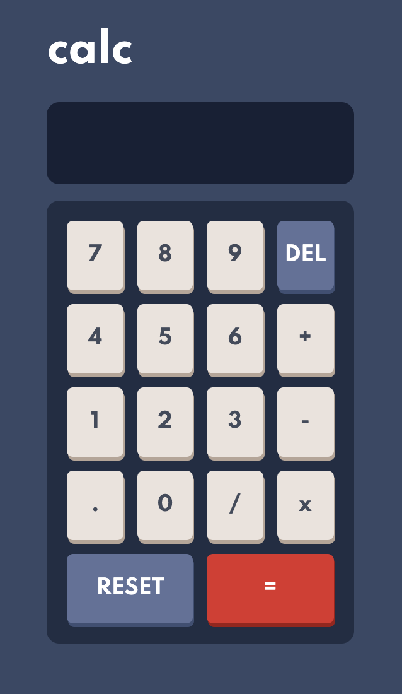

# Frontend Mentor - Calculator app solution

This is a solution to the [Calculator app challenge on Frontend Mentor](https://www.frontendmentor.io/challenges/calculator-app-9lteq5N29).

## Table of contents

- [Overview](#overview)
  - [The challenge](#the-challenge)
  - [Screenshot](#screenshot)
  - [Links](#links)
- [My process](#my-process)
  - [Built with](#built-with)
  - [What I learned](#what-i-learned)
  - [Continued development](#continued-development)

## Overview

### The challenge

Users should be able to:

- See the size of the elements adjust based on their device's screen size
- Perform mathmatical operations like addition, subtraction, multiplication, and division
- Adjust the color theme based on their preference

### Screenshot

### Links

- Solution URL: [Add solution URL here](https://your-solution-url.com)
- Live Site URL: [Here](https://itskerrin.github.io/js-calculator/)

## My process

### Built with

- Semantic HTML5 markup
- CSS custom properties
- Flexbox
- CSS Grid
- Mobile-first workflow

### What I learned

This is the first Frontend Mentor challenge that I have completed. I wanted to create a calculator to brush up on my JavaScript skills and see where I needed to improve, but I also really like that Frontend Mentor challeges you to create CSS from a style guide.

I started out by making the calculator using a series of functions but found that the code got quite long and repetitive. I had just used classes in a weather app so decided to try it the same way and see if it would simplify things. This project was a good opportunity to practice using the this keyword and switch statements which I don't make enough use of.

### Continued development

The CSS is not complete, I will update this soon.
I would like to recreate this without using classes and see if I can improve on my original approach. I would also like to add more advanced operations as this is quite a simple calculator.
